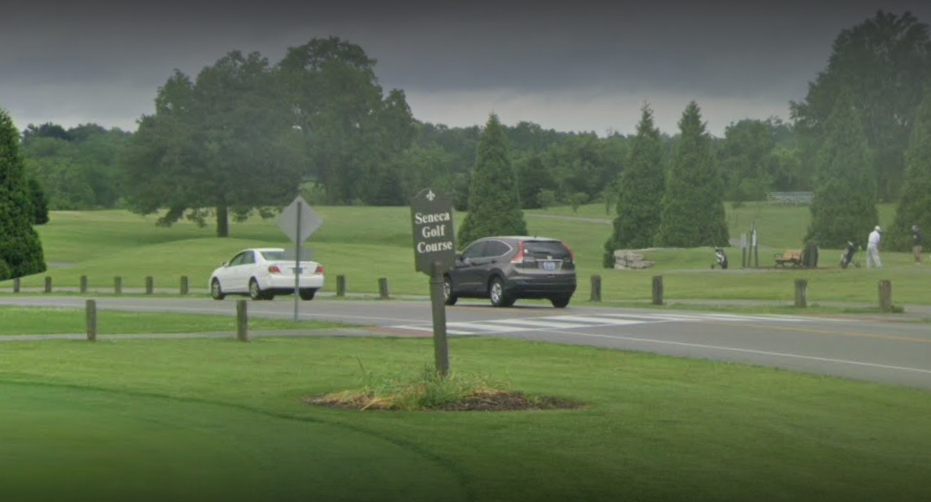

# Seneca-Golf
Seneca Golf 
</img>
 
What is Seneca Golf?  Seneca Golf is an Open Source Golf Simulator that could be the basis for any homebrewer, DIY type, or golf fanatics who want to build and test a Launch Monitor, build a golf course, or design a game.  Why is it called Seneca Golf Course?  Seneca is the name of a Golf course located near my house.  I needed some means of exercise so I started walking the golf course, learned to swing a club, and enjoy the game.  Soon I was bitten by the bug and bought a Zepp and a net. Zepp has some great tutorials and tips but simply tracks the motion of your lead glove hand during the swing.  After trying to teach myself how to swing with the Zepp, I decided to move up to my first simulator, with an Optishot.  This was a really great sensor system that track your club motion as the club face flew over two banks of infrared LEDs.  The first bank is the trigger bank, and the second bank is the one that measures the face angle of the club.  You can get all kind of information about a golf swing from this device.  Interestingly enough, it does not see the golf ball with the LED infrared emitter/detectors.  This got me started in really building out a full simulator, with a projector, impact screen, and golf mats.  I enjoyed the Optishot software too.  It allowed you to play on many real courses with all the hazards and challenges of the real course.  It has great online gameplay, good putting, and a wide selection of courses.  The game is proprietary to Optishot and sadly is looking a little dated when you compare it against newer golf sim software.   
 
So I was always looking at new things when I stumbled on a startup-fundme page that featured a system called Tittle (or SLX mini now).  It was a small Bluetooth-based 6-DOF motion-tracking device that you would attach to your club.  It was one of the coolest golf gadgets ever!  So I bought into Tittle 'go-fund me'.  It came with a simulator called E6  that blew my socks off.  It was amazing in how detailed all the plants, trees, houses and water looked. I was so realistic.  At about the same time, Raposodo had come out with their R-Motion which was a huge rave on the Golfsimulator forums.  It included a license for a trimmed-down version of the original TGC.  It was very much like the Tittle.  Anyway somewhere in that timeframe, I was wondering how to build my own courses for the simulator, and while looking at graphics engines, I found and tested it on Horde 3d (that I always associated with the rock tunneling creatures from "The Devil in the Dark" episode of StarTrek).  Apparently, that project was forked to another called Urho3d.  

https://github.com/urho3d/Uho3d

Urho3d is an open-source project that aims to build a full, robust game engine, like Unity and others but more lightweight.  While playing around with the Urho3D examples I started coding my first course.  Urho3d already had some great built-in physics models and produced complex animation easily.  So I started building a project that I hoped would be a golf simulator one day.  I started with an elevation map of the Seneca Golf Course because I knew the course, and it has some interesting features,  including the 8th hole tee-off over Beargrass Creek, its many massive hills with blind tee shots, a couple of sand traps, bridges, trees, practice areas.  It's just a beautiful public course. With the terrain roughed out, I used a golf cart model (a box with 4 wheels) to ride over the map and verify that feel.  The makeshift 'golfcart' could fire golf balls at objects to get an idea of how a golf ball might play and act on landing, or hitting objects and rolling.   It was about this time that events popped up and I had to stop the project to take it up later.  I never forgot about this code, but I could not find the time to restart the project.  So this is the kickstart.

So I'm opening this project up, for all who want to contribute and build something cool.  This can be a starting point, or whatever you would like to do. 

For those that can't wait (and I would advise not to for now), I've recreated the Seneca Golf Course for TGC2019 along with Cherokee Park Golf Course (one of the oldest Muni golf courses in the USA) and Cresent Hill and soon to be released Charley Vittner Golf course.  I just recently looked at GSPro which also has a nice course creation software and also has an openAPI for DIY Launch monitor systems.  Should be fun.   

Update:  As of 2025, I'm working on building the Seneca Golf Course for GSPpro.  Lidar and images are ready.   And I'm in the process of segmenting the images for Unity.   

Have fun.

